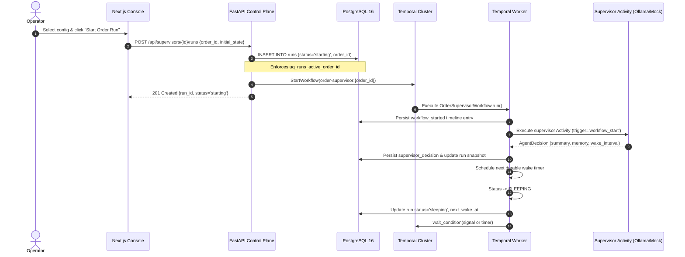

# Application Flow & State Lifecycle Specification

## 1. Executive Overview

This document maps the complete operational and asynchronous lifecycle of an order under supervision. It details how API requests, Temporal signals, durable timers, and AI activities coordinate across the system, followed by an exhaustive state machine transition matrix.

---

## 2. End-to-End Sequence Diagrams

### Flow 1: Order Supervision Initialization



---

### Flow 2: Ingress Signal Delivery & Wake Policy Classification

```mermaid
sequenceDiagram
    autonumber
    participant Source as Carrier / OMS / Operator
    participant API as FastAPI Control Plane
    participant Worker as OrderSupervisorWorkflow
    participant Policy as Deterministic Wake Policy
    participant DB as PostgreSQL 16
    participant LLM as Supervisor Activity

    Source->>API: POST /api/runs/{id}/events {event_id, event_type, payload}
    API->>Worker: Signal receive_event(OrderEvent)
    Worker->>Worker: Deduplication check against seen_event_ids
    
    alt Event ID Already Seen
        Worker->>DB: Persist event_deduplicated audit row
        Note over Worker: Drop event immediately without state change
    else New Event ID
        Worker->>DB: Persist order_event_received timeline row
        Worker->>Policy: classify_event(event_type)
        
        alt Outcome == SUPPRESS (Routine: e.g. payment_confirmed)
            Worker->>Worker: Update OrderState (payment='confirmed')
            Worker->>DB: Persist supervisor_wake_suppressed
            Note over Worker: Return to sleep; LLM is NOT called
            
        else Outcome == WAKE (Important: e.g. shipment_delayed)
            Worker->>Worker: Status -> RUNNING
            Worker->>LLM: Execute supervisor Activity (trigger='order_event')
            LLM-->>Worker: AgentDecision (proposed actions, memory)
            Worker->>Worker: Process proposed business actions
            Worker->>DB: Persist decision & updated memory
            Worker->>Worker: Re-schedule wake timer & return to SLEEPING
            
        else Outcome == COMPLETE (Terminal: delivered)
            Worker->>Worker: Authorize deterministic lifecycle finalization
            Note over Worker: Initiates Flow 5 (Finalization)
        end
    end
```

---

### Flow 3: Business Action Execution Loop

```mermaid
sequenceDiagram
    autonumber
    participant Worker as OrderSupervisorWorkflow
    participant Guard as Semantic Action Guard
    participant Act as Business Action Activity
    participant DB as PostgreSQL 16
    participant External as Simulated Department / Customer

    Note over Worker: LLM proposes action from allowlist
    Worker->>Guard: Check action against cause_event_id
    
    alt Duplicate Action for Same Trigger Event
        Worker->>DB: Persist semantic_duplicate_suppressed audit row
        Note over Worker: Suppress action execution
    else Distinct Action or New Trigger Event
        Worker->>Worker: Derive idempotency_key (run_id:invocation:index)
        Worker->>Act: execute_business_action(request)
        
        Act->>Act: Validate action against supervisor allowlist
        Act->>External: Simulate dispatch (fulfillment, logistics, customer, etc.)
        Act->>DB: append_activity_idempotently(run_id, idempotency_key)
        
        alt Activity Retried (Key Exists in DB)
            DB-->>Act: Existing record returned (created=False)
            Note over Act: Idempotent return; zero duplicate message
        else First Execution
            DB-->>Act: Row inserted (created=True)
        end
        
        Act-->>Worker: BusinessActionExecutionResult (executed)
        Worker->>Guard: Register successful (cause_event_id, action_name)
    end
```

---

### Flow 4: Operator Steering & Lifecycle Overrides

```mermaid
sequenceDiagram
    autonumber
    actor Operator
    participant UI as Next.js Console
    participant API as FastAPI Control Plane
    participant Worker as OrderSupervisorWorkflow
    participant DB as PostgreSQL 16

    rect rgb(240, 248, 255)
    Note over Operator,DB: Scenario A: Injecting Live Steering Instructions
    Operator->>UI: Submit instruction: "VIP customer, prioritize speed"
    UI->>API: POST /api/runs/{id}/instructions
    API->>Worker: Signal add_instruction(RunInstruction)
    Worker->>Worker: Retain in self._additional_instructions
    Worker->>DB: Persist instruction_added audit row
    Note over Worker: Injected into all future supervisor review contexts
    end

    rect rgb(255, 250, 240)
    Note over Operator,DB: Scenario B: Pausing & Resuming Automation
    Operator->>UI: Click "Pause Run"
    UI->>API: POST /api/runs/{id}/pause {reason: "Awaiting warehouse audit"}
    API->>Worker: Signal pause(PauseRequest)
    Worker->>Worker: Status -> PAUSED (Signals still queued; timers frozen)
    Worker->>DB: Persist workflow_paused & update run status='paused'
    
    Operator->>UI: Click "Resume Run"
    UI->>API: POST /api/runs/{id}/resume
    API->>Worker: Signal resume(ResumeRequest)
    Worker->>Worker: Status -> RUNNING (Processes queued signals & overdue wake)
    Worker->>DB: Persist workflow_resumed & update run status='running'
    end

    rect rgb(255, 240, 245)
    Note over Operator,DB: Scenario C: Urgent Human Interruption
    Operator->>UI: Click "Interrupt Run" (High Urgency Flag)
    UI->>API: POST /api/runs/{id}/interrupt {reason: "Suspected credit card fraud"}
    API->>Worker: Signal interrupt(InterruptRequest)
    Worker->>Worker: Status -> INTERRUPTED (Blocks all automated actions)
    Worker->>DB: Persist workflow_interrupted & update status='interrupted'
    end
```

---

### Flow 5: Deterministic Lifecycle Finalization & Completion

```mermaid
sequenceDiagram
    autonumber
    participant Worker as OrderSupervisorWorkflow
    participant DB as PostgreSQL 16
    participant OutputAct as Final Output Activity
    participant API as FastAPI Control Plane
    participant UI as Next.js Console

    Note over Worker: Triggered by 'delivered' event OR graceful terminate Signal
    Worker->>Worker: Set _finalization_in_progress = True
    Worker->>DB: Persist workflow_completed / workflow_terminated audit row
    
    Worker->>OutputAct: generate_final_output(request)
    Note over OutputAct: Synthesizes Final Summary, Important Actions, Key Learnings, Recommendations
    OutputAct-->>Worker: FinalOutputData
    
    Worker->>DB: Update run final_output JSONB & status='completed' / 'terminated'
    Worker->>Worker: Status -> COMPLETED / TERMINATED
    Note over Worker: Workflow method returns WorkflowSnapshot and closes
    
    UI->>API: GET /api/runs/{id}
    API->>DB: Query run snapshot & final_output
    API-->>UI: 200 OK (renders 4-Quadrant Final Output Panel; stops polling)
```

---

## 3. Comprehensive State Machine Specification

The table below specifies all valid lifecycle transitions for an order run. Any transition not explicitly listed is prohibited.

```text
+----------------+--------------------------+--------------------+---------------------------------------+-----------------------------------------------+
| Current State  | Trigger / Event          | Target State       | Guard / Precondition                  | State Transition Actions & Side Effects       |
+----------------+--------------------------+--------------------+---------------------------------------+-----------------------------------------------+
| [INIT]         | StartWorkflow API call   | STARTING           | Order ID has no active run in DB.     | Allocate workflow ID; persist initial row.    |
+----------------+--------------------------+--------------------+---------------------------------------+-----------------------------------------------+
| STARTING       | Workflow init completed  | RUNNING            | None.                                 | Audit workflow_started; run initial review.   |
+----------------+--------------------------+--------------------+---------------------------------------+-----------------------------------------------+
| RUNNING        | Review completed         | SLEEPING           | No pending signals or overdue timers. | Compute next_wake_at; sleep on durable timer. |
+----------------+--------------------------+--------------------+---------------------------------------+-----------------------------------------------+
| SLEEPING       | Scheduled timer expires  | RUNNING            | Workflow not paused or interrupted.   | Wake supervisor with trigger='scheduled_wake'.|
+----------------+--------------------------+--------------------+---------------------------------------+-----------------------------------------------+
| SLEEPING       | Routine signal received  | SLEEPING           | Event is in ROUTINE_EVENTS set.       | Update OrderState projection; audit wake      |
|                |                          |                    |                                       | suppression; resume sleep without LLM call.   |
+----------------+--------------------------+--------------------+---------------------------------------+-----------------------------------------------+
| SLEEPING       | Important signal received| RUNNING            | Event is in IMPORTANT_EVENTS set.     | Wake supervisor with trigger='order_event'.   |
+----------------+--------------------------+--------------------+---------------------------------------+-----------------------------------------------+
| ANY (Non-Term) | Pause Signal received    | PAUSED             | Workflow not already closed.          | Freeze scheduled wake; queue incoming signals;|
|                |                          |                    |                                       | audit workflow_paused.                        |
+----------------+--------------------------+--------------------+---------------------------------------+-----------------------------------------------+
| ANY (Non-Term) | Interrupt Signal received| INTERRUPTED        | Workflow not already closed.          | Block all automated execution; require human  |
|                |                          |                    |                                       | investigation; audit workflow_interrupted.    |
+----------------+--------------------------+--------------------+---------------------------------------+-----------------------------------------------+
| PAUSED /       | Resume Signal received   | RUNNING            | Workflow is in blocked state.         | Release signal queue; catch up overdue wake;  |
| INTERRUPTED    |                          |                    |                                       | audit workflow_resumed.                       |
+----------------+--------------------------+--------------------+---------------------------------------+-----------------------------------------------+
| RUNNING /      | Delivered signal received| COMPLETED          | Event is EventType.DELIVERED.         | Trigger final output activity; persist report;|
| SLEEPING       |                          |                    |                                       | close workflow deterministically.             |
+----------------+--------------------------+--------------------+---------------------------------------+-----------------------------------------------+
| ANY (Non-Term) | Terminate Signal received| TERMINATED         | Graceful termination request with     | Trigger final output activity; persist report;|
|                |                          |                    | documented operator reason.           | mark status='terminated'; close workflow.     |
+----------------+--------------------------+--------------------+---------------------------------------+-----------------------------------------------+
| COMPLETED /    | ANY Signal               | NO CHANGE          | Workflow has closed.                  | Signals ignored; drop without side effect.    |
| TERMINATED     |                          |                    |                                       | Client UI disables active control buttons.    |
+----------------+--------------------------+--------------------+---------------------------------------+-----------------------------------------------+
```

---

## 4. Operational Invariant Guarantees

1. **Signals are never dropped while blocked:** If an order receives customer emails or carrier scans while `PAUSED` or `INTERRUPTED`, Temporal durably queues the signals. The moment the operator clicks `Resume`, all queued signals are processed in arrival order.
2. **Deterministic Catch-up:** If a scheduled wake timer passes while the workflow is in a paused or interrupted state, resuming does not spawn duplicate wake events. The system sets an overdue flag and performs exactly one catch-up review.
3. **Graceful Termination Finalization:** Unlike a raw SIGKILL or `temporal workflow terminate`, the platform's graceful terminate signal authorizes the standard final output activity, ensuring that terminated runs still receive a complete audit summary and operational learnings report.
