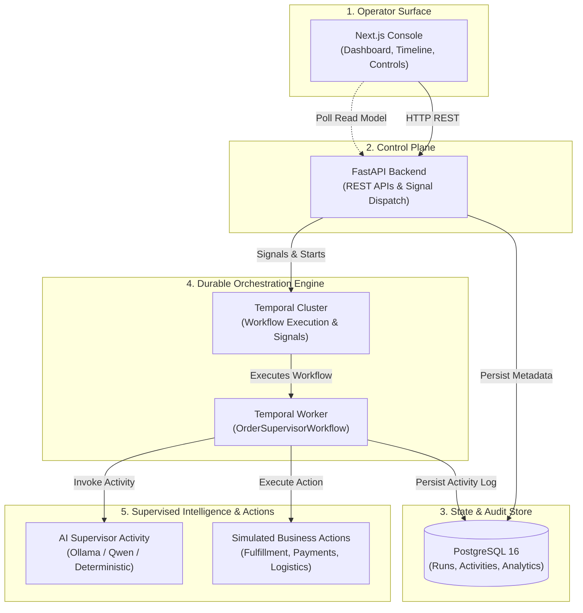

# Order Supervisor — System Architecture

An auditable, durable AI supervisor for long-running order lifecycles built with **Temporal**, **FastAPI**, **PostgreSQL**, **Next.js**, and local LLMs (**Ollama / Qwen**).

---

## 1. High-Level Architecture

The platform separates **durable workflow orchestration** from **AI decision-making** and **operator visibility**:



---

## 2. Core Architectural Pillars

### Pillar 1: Durable Workflow Orchestration (Temporal)
* **One Workflow Per Order:** Each order lifecycle is managed by an independent Temporal workflow (`order-supervisor:{order_id}`).
* **True Durable Sleep (No Busy Polling):** Workflows sleep durably between milestones and scheduled checks, surviving process restarts, network outages, and server redeployments without consuming compute or API tokens.
* **Replay-Safe Orchestration:** All business transitions, timers, and signals are deterministically recorded in Temporal's event history.

### Pillar 2: Intelligent Wake Policy (Cost & Noise Reduction)
Instead of invoking an LLM on every minor event, incoming events (delivered via Temporal Signals) pass through a deterministic wake classifier:

| Event Type | Example Events | Policy Action | LLM Invoked? |
| :--- | :--- | :--- | :---: |
| **Routine** | `payment_confirmed`, `shipment_created` | Logged to PostgreSQL timeline; workflow stays asleep | ❌ **No** |
| **Critical Exception** | `shipment_delayed`, `payment_failed`, `stalled` | Workflow wakes up; passes context to AI supervisor | ✅ **Yes** |
| **Scheduled Review** | Timer expiration (e.g., every 45 seconds) | Periodic health check across open issues and state | ✅ **Yes** |
| **Terminal** | `delivered` | Deterministic completion; triggers final synthesis report | ❌ **No** (Deterministic) |

### Pillar 3: Strict AI Guardrails & Bounded Execution
* **Allowlisted Business Actions:** The AI can only select from 5 strictly typed, pre-authorized actions:
  1. `message_fulfillment_team`
  2. `message_payments_team`
  3. `message_logistics_team`
  4. `message_customer`
  5. `create_internal_note`
* **Zero Autonomous Completion Authority:** The LLM cannot terminate or complete a workflow on its own. Order completion is governed strictly by deterministic lifecycle rules (`delivered` signal).
* **Compact Rolling Memory:** The AI updates a structured summary (order status, verified facts, open questions, actions taken) rather than processing raw, unbounded chat history.

### Pillar 4: Technical & Semantic Idempotency
* **Retry Safety:** Activity execution keys combine `workflow_id`, `run_id`, `invocation_number`, and `action_index`. If an activity retries, PostgreSQL enforces unique constraints to prevent duplicate external messages.
* **Semantic Guardrails:** The workflow tracks action-to-event causality, preventing identical actions from repeatedly firing for the same external trigger event.

---

## 3. Operator Control & Human-in-the-Loop

Operators retain continuous oversight and manual control through the Next.js console:

```text
[ Live Order Run ]
       │
       ├──► Pause       : Freezes timers & queued events; pauses AI execution
       ├──► Resume      : Catches up overdue reviews and processes queued signals
       ├──► Interrupt   : Immediate human-review state; halts all automated actions
       ├──► Steer       : Injects live instructions ("Prioritize speed over cost")
       └──► Terminate   : Graceful operator shutdown with documented reason & final summary
```

---

## 4. Technology Stack

| Layer | Technology | Role |
| :--- | :--- | :--- |
| **Frontend** | Next.js 14 (App Router), TypeScript, Tailwind CSS | Real-time operator dashboard and management console |
| **Backend API** | Python 3.13, FastAPI, Pydantic v2, SQLAlchemy (Async) | High-performance control plane and REST interface |
| **Orchestration** | Temporal Python SDK (`temporalio`) | State-machine lifecycle, timers, and activity dispatch |
| **Persistence** | PostgreSQL 16 (AsyncPG, Alembic) | Normalized audit trail, activity timeline, and analytics |
| **Inference** | Ollama (`qwen3:1.7b`) & Deterministic Engine | Structured JSON decision proposals and post-order synthesis |
| **Infrastructure** | Docker Compose | Local PostgreSQL and Temporal development cluster |
